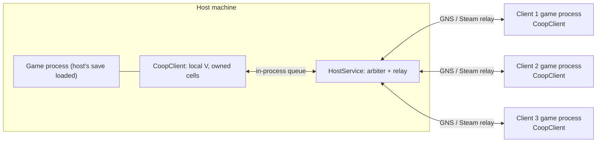
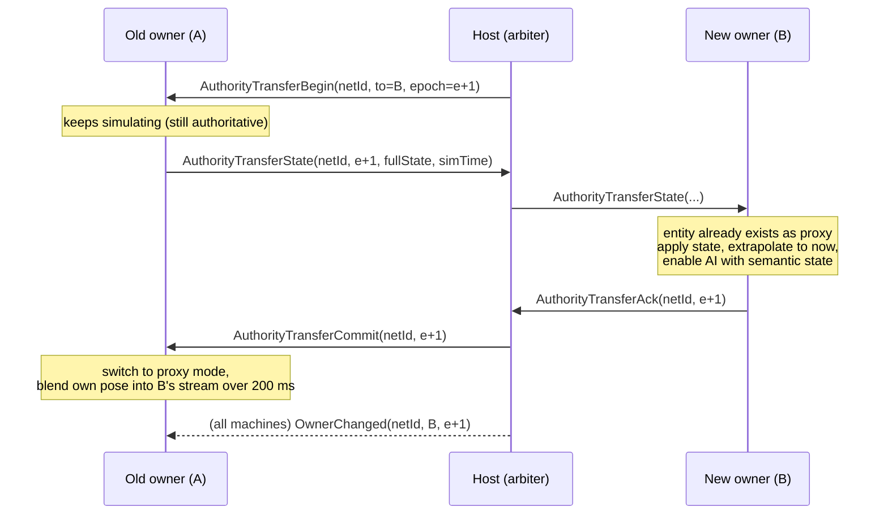
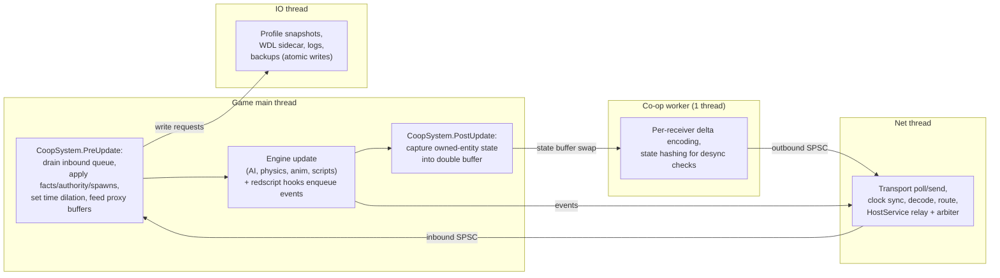
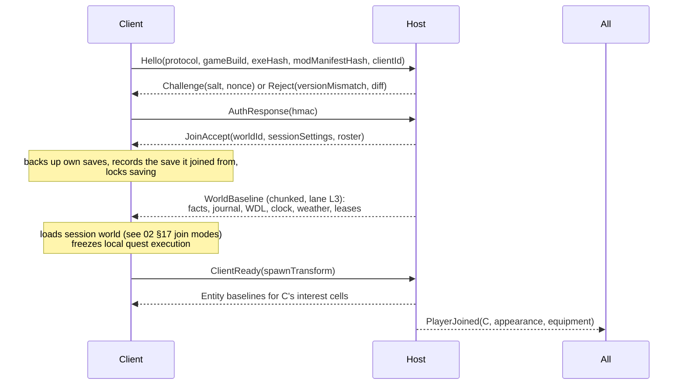
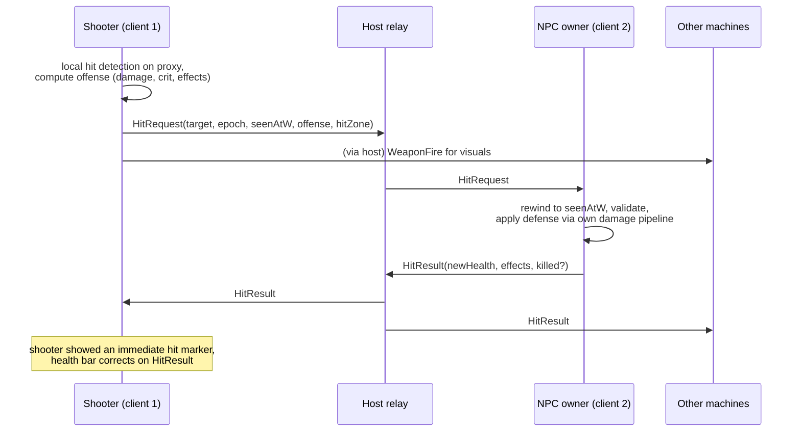
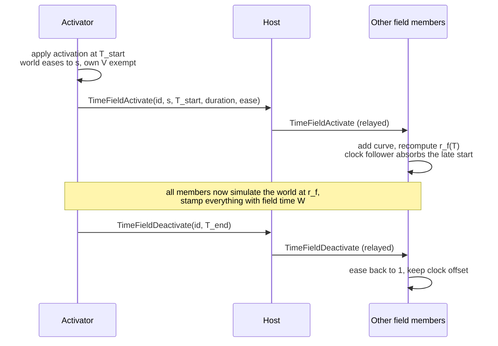
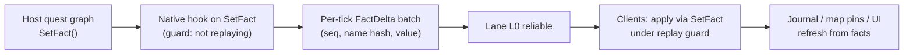

# 01 — Architecture

Status: draft for review · Target: Cyberpunk 2077 PC **2.31** (Windows) · Scope: deliverable 1 (architecture), with system designs in [02-systems.md](02-systems.md) and the wire protocol in [03-network-protocol.md](03-network-protocol.md).

Conventions used throughout these docs:

- **[VERIFY]** marks an assumption about engine internals, followed by how to check it.
- **[COMPROMISE]** marks a place where the "one consistent, logical world" principle cannot be fully met, with the reason and the least intrusive option.
- "Machine" means one player's game process. "Host" is the machine whose save owns the world. "Owner" is the machine currently simulating a given entity.
- `Cp2077Coop` is a placeholder project name.

---

## 1. Foundation: a clean build

The mod is written from scratch on permissively licensed modding libraries. No code from other Cyberpunk 2077 multiplayer projects is used, studied for implementation, or linked; all networking, replication and sync code is original to this project.

This is also a legal requirement, not only a preference: CyberpunkMP's license (Tilted Phoques, LICENSE.md, effective 2024-11-20) forbids "studying, reverse engineering, or analyzing the Software for the purpose of creating […] a competing product", and requires derivatives to use the same license and stay off modding sites. So this project never reads its code. (Checked 2026-10-08 when the question came up: only the license and the public README were read; the clone was deleted unread.) How the engine behaves is learned only from our own in-game experiments (spikes, [08](08-spike-results.md)) and from public modding documentation.

### 1.1 Dependencies

| Library | Role | License | Shipped how |
|---|---|---|---|
| RED4ext + RED4ext.SDK | Plugin loader, reverse-engineered engine types, hooking | MIT | SDK as submodule; RED4ext is a player-installed requirement |
| RedLib | RTTI type/function registration from C++ | MIT | Submodule |
| redscript | Script compiler; gameplay hooks | MIT | Player-installed requirement |
| Codeware | `DynamicEntitySystem`, events, UI, reflection | MIT | Player-installed requirement |
| ArchiveXL | Custom resources (puppet templates, UI) | MIT | Player-installed requirement |
| TweakXL | TweakDB records (puppets, scaling) | MIT | Player-installed requirement |
| RedFileSystem | Script-side file access for settings | MIT | Player-installed requirement |
| Mod Settings | Client-local settings page | MIT | Player-installed requirement |
| Cyber Engine Tweaks | Dev probes and overlays only | MIT | Not required by players |
| GameNetworkingSockets (open source) | Transport: reliable/unreliable messages, lanes, encryption | BSD-3-Clause | Static link |
| zstd (M2+) | Compression of world baselines and save transfer | BSD-3-Clause | Static link |
| miniupnpc | UPnP/NAT-PMP port mapping for direct hosting | BSD-3-Clause | Static link |
| spdlog, Dear ImGui, MinHook | Logging, debug overlay, extra hooks | MIT / MIT / BSD-2-Clause | Static link |
| Steam networking (game's own `steam_api64.dll`) | Optional relay + invites on Steam copies | Valve SDK terms | **Not shipped**: loaded at runtime from the game folder; the interface declarations come from the open-source GNS headers, which mirror Steam's `ISteamNetworkingSockets` [VERIFY flat-API export names in the game's DLL] |

The password handshake uses a small SHA-256/HMAC/PBKDF2 implementation in `src/core/Crypto.cpp`, checked against the published test vectors, so the project needs no separate crypto library (GameNetworkingSockets uses Windows BCrypt or OpenSSL internally for the channel itself). Messages use one in-house bit-packed serializer, so there is no protobuf or code generator either.

Project license: **MIT recommended** (compatible with every dependency above and with distribution on GitHub and Nexus). Your call; see the questions in [README.md](README.md).

### 1.2 Repository layout

```
/
├─ xmake.lua                 build (x64, C++20, MSVC)
├─ LICENSE, README.md
├─ docs/                     these documents
├─ src/
│  ├─ plugin/                RED4ext entry, hooks, CoopSystem (native game system), redscript natives
│  ├─ core/                  NetId registry, owned/proxy modes, cells & interest, time fields, interpolation
│  ├─ host/                  HostService: arbiter, relay, fact log, world-delta log, leases, votes
│  ├─ net/                   ITransport, GNS direct backend, Steam backend, lanes, clock sync
│  ├─ protocol/              message definitions and codec (one bit-packed serializer)
│  ├─ client/                ClientSession: one player's side of a session, IGameAdapter
│  └─ tools/                 desktop tools: sim (SimClient/SimHost), quest-deps, desync-viewer, save-mapper
├─ tools/dev/                bootstrap.ps1, run-two.ps1 and other local test scripts (05-local-testing.md)
├─ scripts/                  redscript → r6/scripts/Cp2077Coop/
├─ tweaks/                   TweakXL YAML → r6/tweaks/Cp2077Coop/
├─ archive/                  WolvenKit project for ArchiveXL resources (M0b+)
├─ cet/coop-dev/             dev-only CET panel: host/join buttons and spike probes (not shipped)
├─ config/                   coop.ini template
├─ tests/                    unit tests and loopback integration tests
└─ vendor/                   submodules: RED4ext.SDK, RedLib (GNS comes through xmake packages)
```

Build: xmake, `xmake -y`, `xmake project -k vsxmake` for Visual Studio. Install target copies the DLL to `red4ext/plugins/Cp2077Coop/`, scripts to `r6/scripts/Cp2077Coop/`, tweaks to `r6/tweaks/Cp2077Coop/`, archives to `archive/pc/mod/`.

### 1.3 What has to exist before anything co-op works (M0 scope)

Because there's no baseline, M0 builds the whole sync foundation: plugin shell and native game system, transport and handshake, clock sync, remote-player puppets with appearance and equipment, locomotion animation sync, vehicle enter/exit/seat sync, debug overlay, version pinning. Everything else in these docs sits on top.

M0 also builds the test tooling, because development happens on one PC with one copy of the game ([05-local-testing.md](05-local-testing.md)): dev instance mode for running two instances side by side, the headless SimClient/SimHost, and network impairment presets in the dev overlay.

---

## 2. Design principles that drive everything below

1. **The engine is single-player; we never fake a second `PlayerPuppet`.** Each machine has exactly one real V (its own player). Other players are puppets. Every system is classified by who it is "about": the local V (local authority), a shared entity (owner authority), or the story (host authority).
2. **Attacker computes offense, victim's owner computes defense.** Damage numbers, crits, perks and quickhack strength come from the attacker's machine (it has the attacker's stats). Armor, resistances, status-effect immunity and death come from the machine that owns the victim. This avoids replicating full stat sheets.
3. **One instance per entity per machine.** An entity is either *owned* (locally simulated) or a *proxy* (driven by the network) on each machine. Ownership changes flip the mode of the same local instance; they never spawn a second copy.
4. **Relay doesn't touch the engine.** The host forwards client-owned entity streams to other clients on the network thread, without main-thread cost.
5. **Global state is facts plus a world-delta log.** Anything that must persist and be seen later by someone else is expressed as a quest fact or a world-delta entry (§6.3), both host-authoritative.
6. **Machines that can see the same thing share one clock.** Any two machines that can observe a common entity always simulate at the same world-time rate (§8). This is what makes shared slow motion consistent.

---

## 3. Components

### 3.1 Topology

Star topology with the host as arbiter and relay. Clients never talk directly to each other in v1.



Why star rather than mesh: one ordering point for global events (facts, authority changes, time fields), one NAT traversal problem per client instead of six pairwise ones, and the extra hop only matters when two clients fight the same NPC far from the host (≈ +RTT/2 on that path). A direct client-to-client "proximity link" is a possible later optimization, not v1.

### 3.2 Process-level components

| Component | Lives in | Responsibility | Source |
|---|---|---|---|
| **CoopClient** | Every game process (`Cp2077Coop.dll`) | Local V capture, puppet management, owned-entity simulation hooks, proxy driving, quest/scene mirroring, time fields, UI | `src/plugin`, `src/core` |
| **HostService** | Host's game process only, same DLL, enabled when hosting | Session membership, auth, cell-ownership arbiter, authority transfers, fact log, world-delta log, relay, time/weather, time-field schedule and membership, votes, quest leases | `src/host` |
| **Protocol** | Shared | One bit-packed serializer for every message (a single `Serialize()` per message for both directions); snapshots add delta baselines | `src/protocol` |
| **Transport** | Shared | `ITransport` with lanes; GNS direct (default), Steam relay (optional), clock sync | `src/net` |
| **Redscript layer** | `r6/scripts/Cp2077Coop/` | Gameplay hooks via `@wrapMethod`, native imports from the DLL, ink UI | `scripts/` |
| **TweakXL layer** | `r6/tweaks/Cp2077Coop/` | Puppet records, scaling modifiers, interactions, privacy-scene table | `tweaks/` |
| **ArchiveXL layer** | `archive/pc/mod/` | Puppet entity templates, UI `.inkwidget`s | `archive/` |
| **CET probes** | Dev only | Engine probes and overlays used by the spikes | `cet/` |
| **Tools** | Desktop | Quest dependency analyzer, desync log viewer, save node mapper | `src/tools` |

### 3.3 In-process modules of CoopClient

```mermaid
flowchart TB
    NET["Net thread<br/>Transport + codecs"] -->|inbound SPSC| SYS
    SYS["CoopSystem (game system, main thread)"] -->|outbound SPSC| NET
    SYS --> SESS["SessionModule<br/>join, roster, version"]
    SYS --> AUTH["AuthorityModule<br/>cells, ownership, handoff"]
    SYS --> ENT["EntityModule<br/>NetId registry, proxy/owned modes"]
    SYS --> TIME["TimeModule<br/>clock sync, time fields, rate control"]
    SYS --> PLY["PlayerModule<br/>local V capture, puppets"]
    SYS --> CMB["CombatModule<br/>hits, status, quickhacks, abilities"]
    SYS --> QST["QuestModule<br/>facts, journal, follower mode, leases"]
    SYS --> SCN["SceneModule<br/>observer replay, choices, privacy"]
    SYS --> WLD["WorldModule<br/>time of day, weather, world-delta log, loot"]
    SYS --> PRV["PreventionModule<br/>heat, crimes, police ownership"]
    SYS --> SAV["SaveModule<br/>save lock, profile snapshots, backups"]
    SYS --> UI["UIModule<br/>lobby, party HUD, settings"]
    SYS --> DBG["DiagnosticsModule<br/>state hashes, desync log, ImGui"]
```



`CoopSystem` is registered as a native game system through RedLib so it ticks with the game and is reachable from redscript as `GameInstance.GetCoopSystem()`. [VERIFY] which update phases a RED4ext-registered game system can tick in on 2.31 (first bring-up task, spike S1).

---

## 4. Remote players as entities

Each remote player is represented on every other machine by one **puppet**:

- Spawned through Codeware's `DynamicEntitySystem`. **As built (M0b):** from a plain NPC record (`Cp2077Coop.Character.RemotePlayer`), because it animates under AI movement; the game's third-person V records (`Character.TPP_Player_Cutscene_Male/Female`) look like V but slide without animating, copy the *local* V's look and weapon, and only the one matching the local V's body spawns (spikes S1, round C). They stay selectable in `coop.ini`. Compromise for now: puppets don't look like their players. Two research steps lead to the intended design: animating a player body (S3c), then dressing the bare player body (`…_No_Impostor_…`, naked and headless) in each player's own head, hair and clothes (S1b).
- Records carry the `player` attitude group (as built: set on spawn, which also lets the local V share a car with a puppet) and, later, the interaction choices "Revive" and "Give item".
- **Appearance:** the owner serializes its V's character-customization state; other machines apply it to the puppet. Equipment, clothing and visible cyberware come from the replicated equipment list. [VERIFY] how to apply a customization state to a non-player entity: the customization system holds a single state (`gameuiCharacterCustomizationSystem.GetState()`), which is probably why V-lookalikes copy the local V. Spike S1b.
- **Movement: AI-steered, not AI off** (changed after spike S3). AI move commands give a puppet normal walk, run and sprint animations, while teleports don't move spawned NPCs at all. So the puppet's AI stays on and is steered: an `AIMoveToCommand` towards the network position plus a 0.4 s lead along the remote player's velocity (walk below 2 m/s, run below 5 m/s, sprint above, one step faster when more than 4 m behind), re-sent at most four times a second with the previous one cancelled. A puppet more than 8 m behind for 3 s, or more than 40 m behind, is respawned at the right place. Compromises for now: jumps, vaults, climbing and falls aren't reproduced (the puppet walks around or is respawned), and the facing of a standing puppet isn't synced. Running an NPC with AI off is still a question for NPC ownership handoff (M1), not for player puppets.
- **Time:** a puppet moves at its player's personal rate. With the world slowed by a time field, the puppet of the player who activated it gets an individual time dilation that ignores the global one (`SetIndividualTimeDilation(…, ignoreGlobalDilation = true)`, spike S8b). As built: in `CoopBridge`, see §8.8.
- **Targetable.** Hostile NPCs must detect, target, shoot and melee the puppet exactly as they would V: attitude group `player`, registered with target-tracking/threat systems, visible to NPC senses. Spikes S2/S2b: the attitude group and per-agent hostility alone aren't enough (the lookalike has no visible-object component and no senses, so NPCs can't perceive it), but injecting the puppet as a threat (`TargetTrackingExtension.InjectThreat`, target tracker `AddThreat`) makes an NPC attack it. The NPC's owner does that for remote players' puppets. [VERIFY] high risk: many scripts call `GetPlayer(game)` / `IsPlayer()` and special-case the real V (detection UI, crime reporting, "don't shoot during scene", difficulty). First task in M1 is an audit: decompile the game's scripts, grep every `GetPlayer(`, `GetLocalPlayer`, `IsPlayer()` and `PlayerPuppet` cast, and classify each call site as "must include puppets", "must stay local-V only", or "irrelevant".
- **Not a scene actor.** Scenes never bind a puppet to the `player` role on its own host machine. Puppets are tagged `Cp2077Coop.Puppet` and filtered out of any player query we wrap.

Rejected alternative: spawning a second `PlayerPuppet`. The player system, input, camera, HUD, equipment and save systems assume a single player object; the blast radius is unbounded.

---

## 5. Transport

### 5.1 Comparison

| | Open-source GameNetworkingSockets | Steam networking sockets (game's `steam_api64.dll`) | GOG Galaxy SDK networking | Direct UDP + overlay VPN |
|---|---|---|---|---|
| Reliable + unreliable messages, lanes, encryption | Yes (AES-GCM; lanes since GNS 1.4) | Yes (same API family) | Basic P2P packets | Whatever runs on top |
| NAT traversal | Only if built with ICE plus a signaling server we'd host | Yes, via Steam Datagram Relay | Galaxy relay | VPN handles it |
| Invites / friends | No | Steam friends, rich-presence "join game" | Galaxy friends | No |
| Store coverage | All (Steam, GOG, Epic) | Steam copies only | GOG copies only | All |
| Risks | Port forwarding needed for direct IP | [VERIFY] relay must be usable for app 1091500; interface version exported by the bundled DLL; coexistence with the statically linked open-source GNS in one process | [VERIFY] whether a mod can use Galaxy networking with the game's credentials | Users must install a VPN |

### 5.2 Decision

`ITransport` abstraction with GNS-style lanes and two backends in v1:

1. **`GnsDirectTransport`** (default, every store): host listens on UDP (default 27077, configurable), tries a UPnP/NAT-PMP mapping via miniupnpc, join by IP:port or a join code that encodes it. Documented fallback: Tailscale/ZeroTier.
2. **`SteamTransport`** (Steam copies, M5): relay and P2P by SteamID, invites through Steam friends. Only if spike S11 confirms it works under app 1091500 from inside the game process. Mixed-store sessions use direct.
3. `GalaxyTransport`: research only.

### 5.3 Session password

- Host sets an optional password. Host stores only `salt` and `PBKDF2-HMAC-SHA256(password, salt, 200k iterations)`.
- Join handshake is challenge–response: host sends `salt` + 32-byte nonce, client replies `HMAC-SHA256(key, nonce ‖ clientId)`. The password never crosses the wire, and GNS encrypts the channel anyway.
- Open-source GNS without a cert authority gives encryption, not server authentication. Acceptable for friends-only sessions; documented.

---

## 6. Authority model

### 6.1 Three authority classes

| Class | Who | Examples |
|---|---|---|
| **Global** | Host (HostService) | Facts, journal, story progression, time of day, weather, session settings, cell-ownership map, time-field schedule and membership, world-delta log, quest leases |
| **Simulation** | The owner of the entity (any machine) | NPC AI and bodies, devices, traffic, crowd, police units, vehicles, projectiles, containers' world state |
| **Personal** | Each player's own machine | Own input, movement (validated), camera, stats, perks, inventory, money, XP, heat level, UI, local save lock, own Johnny |

### 6.2 Authority table

| Domain | Authority | Replicated to | Mechanism | Notes |
|---|---|---|---|---|
| Session settings, roster, password | Host | All | Reliable L0 | — |
| Quest facts | Host; lessee for facts in its lease set | All | `FactDelta` batches, sequence-numbered | Clients never write facts outside a lease |
| Journal entries, objectives, tracked quest | Host (lessee for leased quest) | All | `JournalDelta` | Clients' journals are read-only mirrors |
| Quest graph execution | Host; lessee for leased self-contained quests | — | Followers' quest execution frozen | [02 §1](02-systems.md#1-quest-progression) |
| Scenes and dialogue | Machine running the quest (host or lessee) | Nearby machines | Observer replay + choice mirror | [02 §2](02-systems.md#2-scenes-dialogue-cutscenes) |
| Johnny | Each player's own machine, for their own V only | Nobody | Never replicated | [02 §3](02-systems.md#3-johnny-silverhand-and-relic-events) |
| Time of day, weather | Host | All | `WorldClock`, `Weather` | Clients slew, never snap during play |
| Time fields (shared slow motion) | Host holds schedule and membership; activators propose | Field members | `TimeField*` messages | §8 |
| Cell ownership map | Host (arbiter) | All | `CellOwnership` | §7 |
| NPC AI, health, status effects, death | Entity owner | Interested machines | Snapshots + events | Pinned exceptions in §7.4 |
| Damage to an NPC | Entity owner applies; attacker computes offense | Interested | `HitRequest` → `HitResult` | Owner validates with lag compensation |
| Damage to a player | That player's machine applies; attacker's owner computes offense | All interested | `PlayerHitRequest` | Victim computes armor/mitigation |
| Player transform, animation, camera aim | That player | All interested | `PlayerState` 30–60 Hz | Host sanity-checks speed/teleports |
| Player inventory, money, XP, perks, cyberware | That player | All (summary only) | `PlayerEquipment`, `PlayerVitals` | Never authoritative on another machine |
| Police heat | The wanted player | All | `HeatUpdate` | Police units owned by the wanted player's machine |
| Owned-vehicle summon | Summoner | Interested | Entity spawn | Ownership follows the driver |
| Loot rolls | Each player locally | Host (bookkeeping only) | `ContainerOpened` | Instanced per player |
| World persistence (doors, devices, dead named NPCs, dropped items) | Owner at time of change, recorded by host | All, and on stream-in | World-delta log | §6.3 |
| Time skip | Host arbitrates a vote | All | `SkipRequest/Vote/Commit` | Nobody moves |
| Save files | Host: world save. Each client: own profile only | — | Never cross-written | [02 §17](02-systems.md#17-save-system) |

### 6.3 World-delta log (WDL)

The WDL is how "a place one player changed is in the same state when another player later arrives" holds even when the host never visits that place.

- Entries: `{entityKey, kind, payload, gameTime, author}` where `kind ∈ {DeviceState, DoorState, DestroyedObject, DeadPersistentNpc, DroppedItem, ContainerOpenedBy, CustomFlag}`.
- Written: owner detects a persistent change → `WorldDelta` to host → host appends, assigns sequence, rebroadcasts.
- Applied: on every machine when the entity streams in, by a hook on entity attach that checks the WDL index for that key. [VERIFY] the attach/restore hook point for persistent entities: RTTI dump of the persistency system plus a CET probe logging attach order versus persistent-state restore.
- Stored: in the host's session sidecar next to the host's save (`coop/worlds/<worldId>/wdl.bin`), so it survives across sessions. When the host's own machine streams an area in, the host applies the entries too, so the host's next save naturally contains them. Entries that vanilla wouldn't persist (traffic wrecks) are not logged.

---

## 7. Distributed simulation and ownership handoff

### 7.1 Interest regions and cells

- The world is divided into **cells** of 64 m × 64 m (2D; vertical is ignored except for megabuilding interiors, which get their own cell ids from the interior volume). [VERIFY] 64 m against the engine's NPC and traffic streaming radii; tune in M1.
- Each player reports an **interest region**: the set of cells within radius `R_int` of their V (default 200 m, never less than the local NPC streaming radius, raised in vehicles to cover the forward streaming cone). Sent as `InterestUpdate` at 2 Hz and on cell change.
- A cell is **private** if only one player's interest covers it, **shared** otherwise.
- **Owner of a private cell** = that player's machine. **Owner of a shared cell** = the host's machine if the host's interest covers it, otherwise the covering player with the best score (distance to cell center, lowest RTT to host as tiebreak). Hysteresis: a new candidate must beat the current owner by 25% for 3 s before the arbiter reassigns.
- Entities belong to the cell they stand in, except **pinned** entities (§7.4).

### 7.2 Entity identity

Both machines may already have spawned "the same" NPC independently. Every entity gets a `NetId` from one of three identity classes:

| Class | What | NetId derivation | Duplicate prevention |
|---|---|---|---|
| **P — placed** | Entities placed in sector data: devices, doors, containers, static NPCs | Hash of the engine's persistent/global node id | Same id on every machine, so the second machine maps instead of spawning |
| **C — community/quest** | NPCs from community spawners and quest spawn nodes | Hash of `(community/spawner record, entry name, spawn slot index)` | Spawn arbitration hook: if a remote owner already registered that key, spawn as proxy |
| **D — dynamic** | Crowd, traffic, police units, projectiles, dropped items, Codeware-spawned entities | `(ownerPeerId << 48) | counter` allocated by the spawning owner | Only the cell owner's ambient spawners run in shared cells; others receive proxies |

[VERIFY] the core identity assumption: stand two machines at the same spot (same game version, same mods), log every entity's `EntityID`, persistent id and spawner info, and diff. If class P ids don't match, fall back to hashing `(template path, appearance, quantized spawn transform)`.

### 7.3 Ownership handoff protocol

Triggered when a cell's owner changes or an entity crosses into a cell with a different owner. The arbiter is the host; the protocol guarantees: never two simulating owners, never zero instances, no visible pop.



Rules:

1. **Epochs.** Every entity-scoped message carries the owner epoch. A machine that receives a gameplay event (hit, quickhack) for an entity it doesn't own at that epoch forwards it to the current owner via the host; nothing is dropped.
2. **Overlap, not gap.** Between `Begin` and `Commit`, A stays authoritative and B stays proxy. If `Ack` doesn't arrive within 1 s (or B's interest no longer covers the entity), the host sends `AuthorityTransferAbort` and A keeps ownership.
3. **Full state** = transform, velocity, health/armor, status effects with remaining durations, death/ragdoll flag, current weapon and ammo, combat target and threat list (as NetIds), cover/workspot id, AI "semantic state" (idle / alerted / searching / combat / fleeing / scene), last-known-position of each player. AI is not serialized at the behavior-tree level; B re-seeds its local AI from the semantic state. [VERIFY] which AI inputs can be set from code to restart combat behavior with a given target and last-known position (CET probe on an NPC).
4. **No vanish.** An owner's streaming can unload an entity when its player leaves. Handoff starts when the owner's interest score drops below a threshold, well before streaming distance. While an entity is owned or relevant to any machine, the local instance is pinned against despawn. [VERIFY] how to keep an entity alive outside the local streaming range (spike S9).
5. **No pop.** The new owner starts from the transferred pose; the old owner, now a proxy, error-corrects its displayed pose towards the stream over 200 ms instead of snapping.

### 7.4 Pinned ownership

| Entity | Pinned to | Why |
|---|---|---|
| NPC being grappled, carried body | The grappling/carrying player | Paired animation runs on that machine |
| Vehicle being driven | Driver's machine | Input latency |
| Police units of a wanted player | Wanted player's machine | Prevention logic is per player |
| Quest-spawned NPCs of a running quest | Machine running that quest (host or lessee) | Quest graph references them |
| Projectiles and grenades | Thrower | Detonation authority |

### 7.5 Crowds and traffic

Ambient crowd and traffic are procedural, so two machines' crowds are different people.

- **Private cells:** fully local, not replicated.
- **Shared cells:** only the cell owner's crowd and traffic spawners run. Non-owners suppress their own ambient spawning in that cell and receive low-fidelity proxies (record + appearance id + transform + coarse anim state at 5 Hz for pedestrians, 10–20 Hz for moving traffic).
- When a cell turns from private to shared, the new non-owner's existing ambient entities in that cell fade out where nobody is looking (out of camera frustum), and the owner's are faded in the same way. [COMPROMISE] There is no physically consistent way to reconcile two independently generated crowds; out-of-view swap is the least intrusive option.
- [VERIFY] whether ambient crowd/traffic spawning can be suppressed per area (spike S3).

---

## 8. Time fields (shared slow motion)

Sandevistan and Kerenzikov slow **everything except the activator** — NPCs, physics, projectiles and other players — and everyone who can see it sees the same slow motion. This section is the clock model that makes that consistent over a network; the gameplay rules are in [02 §6.1](02-systems.md#61-sandevistan-and-kerenzikov).

### 8.1 Two clocks

- **Session time `T`:** real time, synchronized across machines (NTP-style ping exchange with min-RTT filtering, host as reference). Never dilated. Global story state (facts, journal, votes, chat) is ordered by `T`.
- **Field world time `W`:** the time the simulated world experiences inside a time field `f`:

  `W_f(T) = W_f(T₀) + ∫ r_f(τ) dτ`

  Every simulated-world message (snapshots, fire events, hits, lag-compensation history, projectile spawns, status-effect timers) is stamped with `(fieldId, W)`.

Outside any field, `r = 1` and `W` simply advances with `T` (plus a constant per-machine offset, §8.6).

### 8.2 The rate function

Each activation `i` is `{peer, scale sᵢ, T_start, T_end, easeIn, easeOut}`, which defines a curve `cᵢ(T)` that eases from 1 down to `sᵢ`, holds, and eases back to 1. The field's world rate is:

  `r_f(T) = min(1, minᵢ cᵢ(T))`

`min` is order-independent, so every machine that knows the same set of activations computes exactly the same `r_f(T)`, no matter in which order the messages arrived. Ending early just updates that activation's `T_end`.

### 8.3 Who runs at what rate

| Inside a field | Real-time rate | Rate relative to the world |
|---|---|---|
| NPCs, AI, physics, vehicles, projectiles, devices, world audio | `r_f` | 1 |
| Non-activating players (their own V on their own machine) | `r_f` | 1 (slowed on their own screen too) |
| Activator `i` | `ρᵢ = r_f / cᵢ` (= 1 for the strongest activator) | `1 / cᵢ` |

So with one activator at 0.25, the world and everyone else run at 25 %, and the activator at full speed (4× relative). With two activators at the same rating both run at full speed and match each other. With 0.25 and 0.5 active together, the world runs at 25 %, the 0.25 activator at full speed (4× relative), the 0.5 activator at half real speed (2× relative): proportional, as required.

Engine mapping on each machine:
- Global time dilation = `r_f` (vanilla mechanism).
- Local V: if activating, exempt from global dilation and given individual rate `ρᵢ`; otherwise dilated normally.
- Puppets of remote players: transform comes from the network (in `W`), so position is automatically right. Their **animation** must play at that player's real-time rate `ρ`, so a puppet is exempt from global dilation and given individual rate `ρ_peer` (`r_f` for non-activators, `ρᵢ` for activators).
- [VERIFY] (spike S8) how vanilla Sandevistan dilates the world and exempts V; whether an arbitrary entity can be exempted from global dilation and given its own rate ≤ 1. Note that no rate above 1 is ever needed.

### 8.4 Starting and stopping without a stall

- The activator applies its activation **immediately** at its own `T_start` and sends `TimeFieldActivate`. The host relays it to field members.
- Other machines receive it one-way latency `L` later (≈ 50–75 ms), having run that long at the old rate. Because the slowdown eases in, the error is small: with a 300 ms ease from 1 to 0.25 and `L = 75 ms`, the remote world is ≈ 7 ms of world time ahead of schedule.
- Each machine runs a **clock follower**: it measures its engine's actually simulated world time `W_eng` and sets engine dilation to `r_f(T) · (1 + clamp(K · (W_f(T) − W_eng), −0.15, +0.15))`. Errors converge within ~0.3 s, invisibly.
- Deactivation (expiry or early cancel) works the same way through the ease-out.
- If an activator disconnects, the host ends their activation at the disconnect time with a normal ease-out.

### 8.5 Field membership and the invariant

**Invariant:** any two machines that can observe a common entity run the same field clock.

- **Local scope (default):** a field contains the activator plus every player whose interest region overlaps any member's, transitively. The host recomputes membership at 2 Hz and broadcasts `TimeFieldMembership`. Because a shared cell requires overlapping interest, every shared cell lies inside a single field, every entity in it is owned by a member, and no entity is ever simulated at two rates. Players far away are unaffected and see nothing, because nothing they can observe is slowed.
- **Joining a running field:** a player who comes into range eases from 1 to `r_f` over 300 ms (they've entered the slowed area). Shared-cell streams with field members only start once their ramp is complete, so the invariant holds during the transition.
- **Leaving:** the player eases back to 1 and continues on their own clock.
- **Global scope (host setting):** every player is always a member. Simpler, but a Sandevistan in one fight slows players everywhere, including a story scene across the map.

### 8.6 Clock debt

While a field runs at `r < 1`, its world falls behind session time by `D_f = ∫ (1 − r_f) dT` (6 s after an 8 s activation at 0.25). Nothing outside the field could observe that region, so nothing needs to be repaid:

- Each machine keeps a constant **clock offset** `W − T` that changes only while it's in a field. The host tracks every peer's offset and includes it in `RosterState`; when two machines' interests next overlap, the joiner's stamps are translated by the offset difference. Entity states carry no absolute time, so nothing else changes.
- Game time of day: [VERIFY] whether it dilates with global time dilation. If it does, each machine slews its time of day back to the host's over 10 s after leaving a field (the gap is at most a few game minutes).
- Quest timers and global events run on `T` and are unaffected.

### 8.7 Interpolation, sending and lag compensation inside a field

- Proxies interpolate on the `W` axis. The render time is `W_render = W_f(T_now − D_real)`, i.e. the normal real-time interpolation delay mapped through the rate function. Slowed players and NPCs therefore appear at exactly the reduced rate they're really moving at, and the activator's puppet appears 1/`cᵢ` times faster. This is how "the activator's slowed view of other players stays smooth": the others really are slowed on their own machines, and their stream is replayed on the same time axis.
- Send rates: slowed entities need fewer real-time samples (≥ 1 per 33 ms of `W`): send interval = `min(33 ms / r_f, 100 ms)` real time. The activator's stream stays at 60 Hz real time. Bandwidth stays roughly flat.
- Lag compensation rewinds in `W`. A real-time latency `L` corresponds to only `r_f · L` of world time, so hit validation is tighter during slow motion.

### 8.8 As built (M1, game-independent part)

`src/core/TimeFieldClock.cpp`, `HostService` and `ClientSession`; tests in `tests/test_timefields_net.cpp`.

- **Everyone knows everything:** the host relays every activation to every machine, and broadcasts proximity groups (players within 150 m of each other, transitively; or one group in global scope) at 2 Hz, with the time of each player's last group change. From that, every machine computes every player's world rate and personal rate. In tests all machines agree to within 10⁻⁶ at any instant.
- **A field is a group with an activation in it.** A player's world rate is the deepest slow-down among activations whose activator is in their group; when the group changes they crossfade over 300 ms (walking into or out of range, groups merging or splitting).
- **World time per machine:** `W = T` outside fields. Each machine integrates its own world rate from an anchor kept one second behind, so an activation or group change that arrives late still corrects recent world time. After a 4 s Sandevistan at 0.25, every slowed machine ends exactly 3.000 s behind and unaffected machines at 0. This is the clock follower's target in the game.
- **Streams:** the activator sends at 60 Hz; slowed players send one sample per 33 ms of world time (at most 100 ms apart); `PlayerState` carries `W` when it differs from `T`; puppets get their player's personal rate for animation.
- **Still in the game's hands (S8):** applying global dilation and V's exemption, the clock follower against the engine's simulated time, puppet animation rates. The dev panel can try the global part ("Apply to the game").

**In the game (as built after spikes S8 and S8b):** the plugin hands the bridge the session's world rate and whether the local V is activating, every frame. The bridge applies the world rate as the game's global time dilation (`TimeSystem.SetTimeDilation`, reason `coopField`) once it has settled after an ease, and only when it moved by more than 0.02; it exempts V while V activates (`SetIgnoreTimeDilationOnLocalPlayerZero`); and it gives each puppet whose player runs at a different rate than the local world that rate, ignoring the global dilation (`SetIndividualTimeDilation(…, ignoreGlobalDilation = true)`). When a session ends the game gets normal time back at once. Compromises for now: the 300 ms eases are applied as steps; an activator inside someone else's slower field runs at full speed instead of slightly slowed; the game's own Sandevistan and Kerenzikov aren't connected to the session yet (§8.9). `coop.ini` `[time] applyToGame=false` turns it off.

### 8.9 Other sources of time dilation

| Source | Treatment |
|---|---|
| Sandevistan, Kerenzikov and any other cyberware that uses the same dilation path | Time field |
| NPCs with their own Sandevistan-style speed-up | Individual NPC rate on its owner; animation rate replicated; no field |
| Presentation slow-motion and pauses (scanner/quickhack menu slowdown, inventory/map/pause menus, photo mode, cinematic finisher slow-mo) | Allowed only when the player is alone in their field; otherwise suppressed. [02 §20](02-systems.md#20-pause-menus-and-presentation-slow-motion) |

---

## 9. Replication

### 9.1 Encoding

- **Snapshots** (unreliable lane): custom bit-packed codec, delta-encoded against the last snapshot the receiver acknowledged (per-receiver baselines). Position quantized to 1 cm relative to the cell origin; rotation as yaw/pitch for humans (16 + 10 bits) and smallest-three quaternion (29 bits) for vehicles and ragdolls; velocity 3 × 12 bits; animation as a compact "anim state" struct (§9.3). Stamped with `(fieldId, W)`.
- **Events and global state** (reliable lanes): the same bit-packed serializer, without delta baselines. Large payloads (baselines, save transfer) are compressed with zstd from M2.
- **Names** (fact names, record ids, scene paths) are sent as 64-bit hashes with a per-session string dictionary sent once on first use.

### 9.2 Rates and budget (4 players, worst realistic case)

| Stream | Rate | Size per entity (delta) | Typical count | Per receiving machine |
|---|---|---|---|---|
| Player state | 30 Hz; 60 Hz within 30 m of another player in combat or while activating a Sandevistan | ~14 B | 3 remote players | ~1.3–2.5 KB/s |
| NPC snapshots, combat | 20 Hz | ~12 B | 25 | ~6 KB/s |
| NPC snapshots, idle / far | 5 Hz / 2 Hz | ~8 B | 40 | ~1.5 KB/s |
| Player-driven vehicles | 30 Hz | ~18 B | 2 | ~1 KB/s |
| Traffic and crowd (shared cells) | 10 / 5 Hz | ~8 B | 40 | ~2.5 KB/s |
| Combat events (fire, hits, status) | bursty | — | — | 2–8 KB/s |
| Packet headers (UDP/IP + GNS) | ~30 pkts/s | ~44 B | — | ~1.3 KB/s |
| **Total per client (downstream, peak)** | | | | **≈ 15–25 KB/s (120–200 kbit/s)** |

Host upstream in a star is roughly 3× that plus relayed client streams: **≈ 60–100 KB/s (0.5–0.8 Mbit/s) peak.** Fine on typical home broadband; the lobby warns hosts with measured upload below 2 Mbit/s.

### 9.3 Interpolation, extrapolation, lag compensation

- **Interpolation delay:** proxies render at `D` behind the newest data, `D = clamp(2 × sendInterval + jitter_p95, 70 ms, 250 ms)` real time, adapted per sender and mapped through the field rate (§8.7). At 30 Hz and 150 ms RTT, D ≈ 90–110 ms.
- **Extrapolation:** dead reckoning up to 200 ms past the last snapshot, then hold and fade the proxy's animation to idle. Never extrapolate death, ragdoll or scene state.
- **Animation state:** for players, locomotion state, stance (stand/crouch/slide/cover), aim pitch/yaw, weapon id and state (idle/fire/reload/equip), melee move id + time, cyberware action id + time, interaction/workspot id, individual time rate. For NPCs, the same plus the AI semantic state. Proxies feed these into their animation graph inputs. [VERIFY] which animation-feature structs and graph variables drive human locomotion and combat, and whether they can be set on a proxy whose AI is off (spike S3).
- **Lag compensation:** every owner keeps a 1 s history (at 30 Hz) of hit-volume transforms for its owned entities. A `HitRequest` carries the world time at which the shooter saw the target; the owner rewinds to that time (max 400 ms real time, mapped to `W`) to validate.

### 9.4 Validation (co-op trust model)

This is co-op among friends, so validation targets **desync and bugs, not cheating**: speed and teleport sanity on player movement (scaled by the player's current time rate), range/line-of-sight and fire-rate checks on hits, ammo plausibility. Failures are logged and corrected (owner's state wins), not punished.

---

## 10. Threading model



Rules:

- **All engine and RTTI calls happen on the main thread.** No engine call is treated as thread-safe unless proven. [VERIFY] which game-system calls are safe off-thread; until then, none.
- Hand-over between threads: a queue of events (never dropped, except status text beyond a cap) and a "latest pose per entity" slot that the main thread drains each frame, so a slow frame never builds a backlog of stale snapshots. Mutex-protected rather than lock-free: the sections are a few microseconds and contention is two threads; lock-free rings stay an option if profiling ever shows contention.
- **Loading screens** (fast travel, joining, the host's own reloads): the net thread keeps heartbeats, acks, clock sync and relay running while the main thread is blocked. A machine in a load is marked `Loading` in the roster so others don't time it out (90 s cap). A loading machine is never a time-field member.
- **HostService on the net thread:** arbitration, relay, time-field schedule/membership and fact/WDL bookkeeping are pure data structures with no engine calls, so relaying client streams costs the host no main-thread time.
- **Time-field rate control** runs once per frame in `PreUpdate`, before the engine update, so the frame is simulated at the right dilation.
- **Steam backend:** the game itself pumps Steam callbacks; we poll Steam networking sockets from the net thread. [VERIFY] that the game calls `SteamAPI_RunCallbacks` regularly, or register a manual dispatch.
- **Budget:** ≤ 1.0 ms main-thread time per frame for co-op work with 4 players and 40 replicated NPCs, measured by the ImGui profiler panel from M1 on.
- **As built (M0b):** `SessionRunner` (`src/client/SessionRunner.cpp`) owns the transports, the HostService and this machine's ClientSession and ticks them every 4 ms on the net thread. One session mutex covers everything the net thread ticks; main-thread calls (host, join, leave, vehicle requests, status) take it briefly. `CoopSystem` calls `SessionRunner::Pump` once per frame on the main thread: it hands over the latest local player and vehicle samples and delivers queued events and remote poses to the game. Tests check that the game adapter is only ever called on the main thread, that a 3 s main-thread freeze keeps the session alive with a 1.5 s timeout, and run clean under ThreadSanitizer for our code. Until the `Loading` roster state exists, a load longer than the peer timeout is still fine: heartbeats come from the net thread.

---

## 11. Key data flows

### 11.1 Join



### 11.2 Player shoots an NPC owned by another machine



### 11.3 Sandevistan activation



### 11.4 Fact replication



---

## 12. Failure modes

| Failure | Detection | Handling | Player-visible effect |
|---|---|---|---|
| Client disconnects | GNS connection state / 10 s silence | Its puppet holds pose for 10 s ("signal lost" shimmer), then despawns. Its owned cells: if another player covers them, handoff from last known state; otherwise nobody can see them and they're dropped. Its leases are rolled back. Its time-field activations end with an ease-out | Others see the puppet fade after 10 s |
| Host disconnects or crashes | Same | Session ends. Every client writes a final profile snapshot and offers "Return to your world" | Clients keep all character progress up to the last snapshot (≤ 60 s) |
| Client crashes | Next launch finds a `pending-return` marker | Recovery prompt applies the last profile snapshot to the client's own save | No data loss beyond 60 s |
| Packet loss / jitter spike | Ack gaps, jitter p95 | Interp delay grows up to 250 ms; reliable lanes retransmit; snapshots skip | Slightly floatier remote motion |
| Authority transfer times out | No Ack in 1 s | `Abort`, old owner keeps the entity | None |
| Duplicate entity detected (same key, two owners) | Registry on host | Lower-priority instance converted to proxy and faded out of view | Rare brief fade |
| Owned entity unloads before handoff | Streaming hook | Keep-alive pin; if pin fails, emit `EntityLost`, host reassigns from last snapshot | Possible pop (logged as bug) |
| Time-field clock drift beyond 50 ms of world time | Clock follower error | Follower correction saturates at ±15 %; above 250 ms the host sends `TimeFieldState` and the machine re-anchors | Brief speed-up or slow-down of the world |
| Two activations race | Both arrive at host | No conflict: `r_f = min` is order-independent | None |
| Desync (health, position, dead-vs-alive) | Periodic per-category state hashes (§13) | Owner sends full state to the diverged machine | Small correction |
| Game updated (address/pattern scan fails) | Startup self-test | Co-op menu disabled with "unsupported game build"; single-player untouched | No co-op until updated |
| Version or mod-manifest mismatch | Handshake | Reject with readable diff | Join refused with a list |
| Quest lease holder disconnects mid-gig | Disconnect | Host restores the pre-lease fact snapshot for that quest; quest becomes available again | Gig resets |
| Host's world reloads (main-quest failure, ending) | Host event | `WorldReset` broadcast; clients re-baseline facts/WDL without reloading or moving | World state jumps back (flagged compromise) |
| Save write interrupted | Atomic write protocol | Temp file + flush + rename + 3 rotating backups; checksummed JSON | None |
| Engine crash inside our hook | Crash handler | Minidump + last 2 min of co-op log to `coop/crashes/` | Crash (hopefully rare) |
| Steam relay unavailable | Connection failure | Offer direct IP fallback | Extra step |

## 13. Diagnostics built into the architecture

- Every machine computes, once per second, hashes per category: owned-entity health/alive set, fact table digest (rolling), roster/equipment, cell-ownership map, time-field schedule. The host compares and logs divergences with the entity ids involved.
- Every message is optionally recorded (`coop/logs/<session>/<peer>.netlog`) with timestamps, for replay in the desync viewer (`src/tools/desync-viewer`).
- ImGui panel: roster, RTT/jitter/loss per peer, lane queue depths, owned/proxy counts per cell, current authority transfers, active time fields with `r_f` and clock-follower error, last 50 facts.
