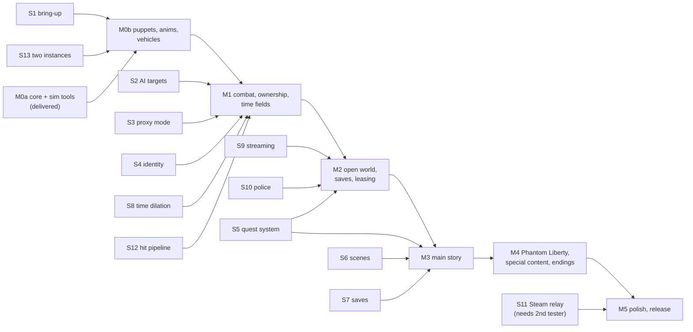

# 06 — Milestone roadmap

Deliverable 3. Estimates are **focused full-time weeks** for one developer with code support; at hobby pace multiply by 2–3. They are ranges because most milestones depend on reverse-engineering spikes that can succeed or force a fallback ([04 §3](04-feasibility-and-risks.md#3-reverse-engineering-spikes-do-these-first)).

Test setup assumed throughout: one PC, one Steam copy, 16 GB RAM, 12 GB VRAM ([05-local-testing.md](05-local-testing.md)). With 16 GB, two game instances will page heavily, so the **primary loop is one game plus the headless SimClient/SimHost**; two-instance runs are used when a test truly needs two engines. Every exit criterion below is written so it can be checked on that setup.

---

## M0 — Foundation: two players connect and see each other

### M0a — core and test tools (delivered with this document)

| Area | Delivered |
|---|---|
| Portable core (`src/core`) | Bit stream, quantization, SHA-256/HMAC/PBKDF2 for the password, clock sync, time-field math and clock follower, interpolation buffers |
| Protocol (`src/protocol`) | M0 message set with one serializer for read and write, envelope, protocol version |
| Transport (`src/net`) | GameNetworkingSockets backend with lanes, in-process socket pairs, impairment presets |
| Host (`src/host`) | HostService: handshake, password challenge, version check, roster, relay, clock-sync responder, timeouts |
| Client (`src/client`) | ClientSession: connect, handshake, clock sync, 30 Hz state send, interpolation, puppet lifecycle through `IGameAdapter` |
| Sim tools (`src/tools/sim`) | `coop-sim host`, `coop-sim client` with scripted movement (circle, line, follow), multiple bots per process |
| Plugin (`src/plugin`, Windows) | RED4ext entry, `CoopSystem` game system ticking each frame, script bridge adapter, `Host`/`Join`/`Leave` natives |
| Scripts (`scripts/`) | Bridge that captures the local V and spawns puppets that follow the network position (teleport; animated walking is M0b) |
| Tweaks (`tweaks/`) | Placeholder remote-player record |
| CET dev panel (`cet/coop-dev`) | Host/Join/Leave, impairment presets, live status, and probes for S1, S2, S3 and S8 |
| Tests (`tests/`) | 27 unit and integration tests, including full sessions (host player + 3 clients, wrong password, wrong build, full session, leaving) over real UDP connections |

### M0b — make it look right (after S1, S13)

Delivered without needing the game:

| Area | Delivered |
|---|---|
| Network thread | `SessionRunner`: transports, HostService and ClientSession on their own thread; the game only touched from the main thread through `Pump()`. A frozen main thread (loading screen) no longer times a player out |
| Vehicle sync (portable) | Spawn, despawn, 30 Hz snapshots with quaternion rotation, host seat arbitration, ownership handoff to the driver with epochs, rules for players leaving, late joiners ([02 §11](02-systems.md#11-vehicles)) |
| Appearance updates | Changed appearance or clothing is re-sent automatically (once the game side can read it, S1) |
| Sim tools | `drive` and `ride` scripts: a bot summons a car and drives it, another gets in as a passenger |
| Tests | 39 total: runner threading, freeze survival, vehicles (deterministic in-memory network), stale-epoch rejection, forged-spawn rejection; ThreadSanitizer clean for our code |
| Dev panel | S1 vehicle probes: spawn a vehicle, move it from outside, seat an NPC, dump vehicle types |

Delivered after spike rounds A and B ([08](08-spike-results.md)), waiting for an in-game check:

| Area | Delivered |
|---|---|
| Puppet body | Plain NPC body that animates (the V-lookalikes slide; opt-in in `coop.ini`); the remote player's body gender is reported for later |
| Puppet movement | AI move commands towards the network position with a short lead, walk/run/sprint by speed, catch-up, respawn when far behind; player-aligned on spawn ([01 §4](01-architecture.md#4-remote-players-as-entities)) |
| Dev panel | Round C probes (S3b, S1b, S2b, S8b, S1v-b), lineup of V-like bodies, round D probes (S2c, S1c) |
| Two games on one PC | S13 works on Steam; the second game becomes dev instance 2 on its own (own name and id) |

Still to do (needs spike results):

- A player body that animates under AI movement (S3c), then each puppet showing its own player's appearance, clothing and weapon (S1b, starting from the bare `No_Impostor` body).
- Jumps, vaults, climbing and the facing of a standing puppet.
- Game side of vehicles: register V's car, spawn and drive proxies, mount puppets in seats, seat the local V as a passenger (S1v-b).
- Dev instance mode for two instances (only if S13 shows Steam allows it).
- Version pinning self-test.

### M0 exit criteria (checkable on one PC)

1. Your game hosts; a SimClient joins over loopback with the "Typical" preset and appears as a walking puppet with no visible stutter.
2. Your game joins a `coop-sim host` and shows its scripted players.
3. Your game plus three SimClients run 30 minutes without a disconnect; host upload under 100 KB/s.
4. If S13 passes: two instances see each other and can share a car.

**Estimate:** M0b 3–5 weeks.

---

## M1 — Combat and core co-op

**Spikes first:** S2, S3, S4, S8, S12, S9 (entity pinning part).

**Work:** script audit of every `GetPlayer`/`IsPlayer` call site; cells and interest; entity identity; ownership handoff; NPC proxy mode; NPC snapshot codec; combat pipeline (fire, hits both directions, status effects, area effects); downed/revive/respawn; enemy scaling; time fields (Sandevistan, Kerenzikov) and pause/menu rules; dedicated network thread; desync hashes and viewer v1.

**Done ahead of the spikes (game-independent):**

| Area | Delivered |
|---|---|
| Time fields | Activations relayed to every machine with host validation; proximity groups at 2 Hz (local or global scope); every player's world and personal rate computed identically everywhere; 300 ms crossfades on joining and leaving; per-machine world clock with late-information correction; slowed send rates; puppet animation rates ([01 §8.8](01-architecture.md#88-as-built-m1-game-independent-part)) |
| Sim tools | `--sandevistan scale,seconds,period`: bots activate on a schedule and really slow down when someone else does |
| Dev panel | Sandevistan button for your V, live rates, experimental "apply to the game" switch (S8) |
| Tests | 48 total; time fields: rates on every machine, real slowed movement, proportional overlap, cancel and disconnect, easing in and out of range, late joiners, global scope, refusal of bad activations; world clocks agree exactly |
| CI | GitHub Actions: Linux and Windows build and test on every push; Windows uploads the assembled mod |
| Time fields in the game | Built into the bridge after spikes S8/S8b: global dilation from the session's world rate, V exempt while activating, puppets at their players' own rates, normal time when a session ends (`[time] applyToGame`) |

Still needs S8 in the game: applying dilation and V's exemption properly, the clock follower against the engine's own simulated time, puppet animation rates.

**Exit criteria:**
- You and two SimClients fight a gang; NPC ownership hands off as SimClients move, with zero duplicate or vanished NPCs in the desync log.
- Damage applies both ways (NPCs shoot puppets, puppets' scripted hits damage NPCs).
- Sandevistan: your activation slows the SimClients' stream and their activation slows your world, with matching rates in the log.
- Downed/revive with a SimClient scripted to revive you.

**Estimate:** 10–16 weeks.

---

## M2 — Open world, saves, leasing

**Spikes first:** S10, S9, S5 (lease part).

**Work:** crowd/traffic policy for shared cells; per-player police; instanced loot and the world-delta log; XP, money, street cred; owned vehicles, summons and vehicle combat; fast-travel robustness; time-skip vote; quest leasing for gigs and NCPD hustles; party HUD v1; phone feed v1; save lock, profile snapshots, return-to-own-world flow (join mode A).

**Exit criteria:**
- An NCPD hustle and a gig completed with a co-op partner (two instances or, failing that, a SimClient present for the scripted parts).
- A client leases a gig and completes it alone; the host's world records it.
- Profile snapshot and return flow round-trip a character with no loss (checked by diffing the character data).
- 2-hour soak without desync reports.

**Estimate:** 12–18 weeks.

---

## M3 — Main story

**Spikes first:** S5, S6, S7.

**Work:** client follower mode; fact and journal mirroring; remote triggers; scene observer replay (or animation-hint fallback); dialogue choice mirror; holocalls; privacy volumes; Johnny per player; quest-critical failure handling; join mode C if S7 allows; matched-progress transplant; `quest-deps` tool.

**Exit criteria:** Act 1 main jobs (from The Rescue to The Heist) playable with host and client, each job passing its line in the quest regression checklist (written at the start of M3).

**Estimate:** 16–26 weeks. Highest uncertainty in the project.

---

## M4 — Phantom Liberty, special content, endings

**Work:** Phantom Liberty main jobs; Dogtown specifics (airdrops); braindance, cyberspace and flashback handling (body visible, screen-share spectating); AVs, Delamain and scripted vehicles; point of no return and endings with `WorldReset`.

**Exit criteria:** Phantom Liberty main story and one base-game ending completed in co-op, checklist green.

**Estimate:** 10–16 weeks.

---

## M5 — Polish and release

**Work:** lobby and settings UI; Steam relay and invites (S11, needs a second tester with their own copy); mod-manifest checks; crash and desync recovery; installer; player documentation; performance pass.

**Exit criteria:** release candidate tested by outside players on their own copies.

**Estimate:** 6–10 weeks.

---

## Total

Roughly **60–90 focused weeks** (about 1.2–1.8 years full-time), or 2–4 years at hobby pace. M0 and M1 are the most predictable; M3 can move by months depending on S5 and S6.
